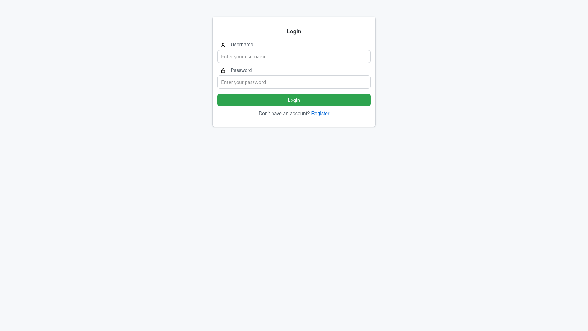
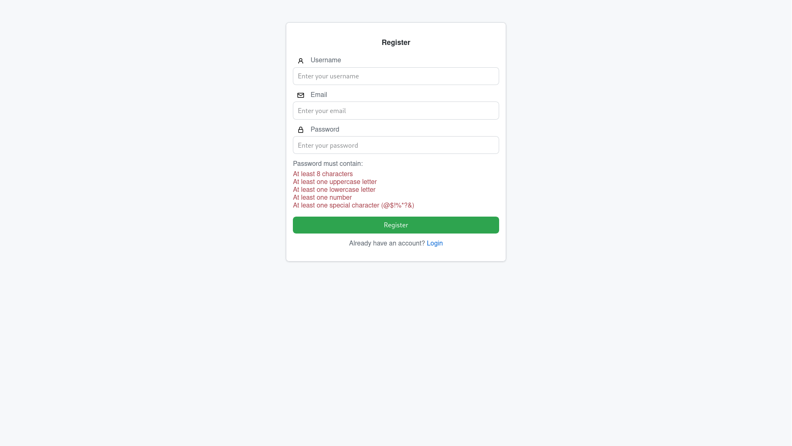
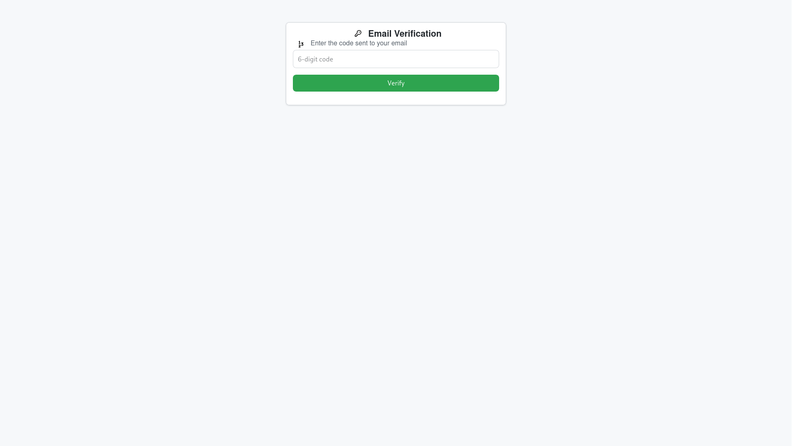
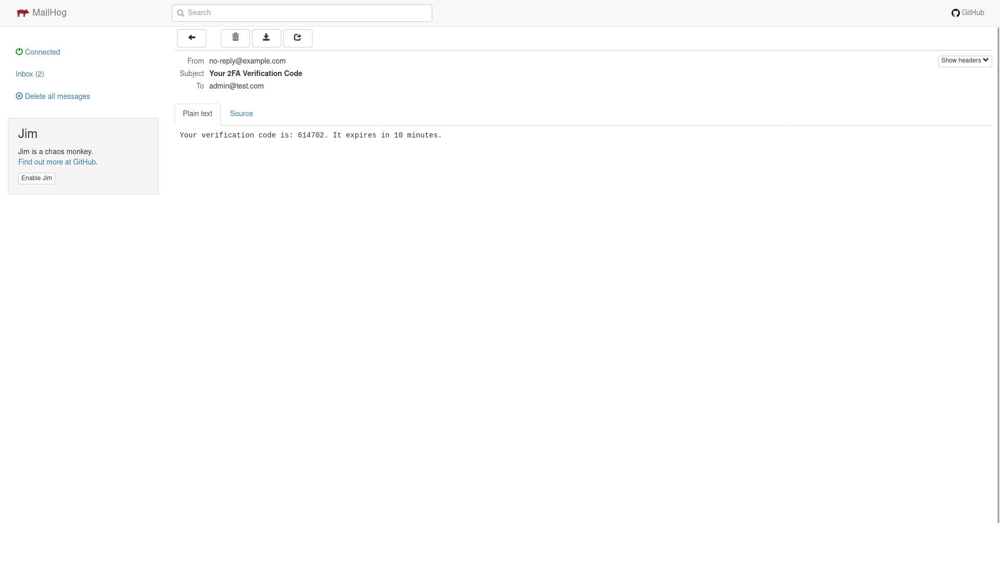

# nodejs-auth-starter

nodejs-auth-starter is meant to be a starting point for development purposes. Basic 2FA is built in, along with secure input checking. The entire app loads new pages in real time and it was built with Node.js, Express, and vanilla JavaScript. The app stores data in SQLite, and bundles client-side code with Webpack. MailHog is used for local email testing.

  
*login-ss.png*

  
*register-ss.png*

  
*2fa-ss.png*

## Features

- User dashboard with dynamic URL generation
- Login page with secure login (JWT auth)
- Email 2FA verification pre-issued tokens
- SQLite database
- .ejs UI templates
- Helmet CSRF protection and secure HTTP headers
- Webpack config

## Setup

1. **Clone the repository:**
   ```bash
   git clone https://github.com/cgtwig/nodejs-auth-starter
   cd nodejs-auth-starter
   ```

2. **Install dependencies:**
   ```bash
   npm install
   ```

3. **Rename the file `.env-example` to `.env` in the project root**. Or create a new file with the contents of `.env-example` below.
   - Generate values for the blank lines (`JWT_SECRET`, `ENCRYPTION_KEY`, `ENCRYPTION_IV`, and `CSRF_SECRET`)
   ```bash
   openssl rand -hex 32   # For JWT_SECRET, ENCRYPTION_KEY, and CSRF_SECRET (generate different one for each)
   openssl rand -hex 16   # For ENCRYPTION_IV
   ```

   #### `.env-example`
   ```env
   # Server Configuration
   PORT=3000
   NODE_ENV=development
   # JWT Secret Key (Used for Authentication Tokens)
   JWT_SECRET=
   # MailHog SMTP Configuration (Local Development)
   SMTP_HOST=127.0.0.1
   SMTP_PORT=1025
   SMTP_SECURE=false
   # SQLite Database File
   DB_PATH=./database.db
   # Allowed Origins (Frontend URLs that can access the backend)
   ALLOWED_ORIGINS=http://localhost:3000,http://127.0.0.1:3000
   # Allowed Hosts (Prevent Host Header Injection)
   ALLOWED_HOSTS=localhost:3000,127.0.0.1:3000
   # Encryption Keys (Generate Secure Random Values)
   ENCRYPTION_KEY=
   ENCRYPTION_IV=
   # CSRF Protection Secret
   CSRF_SECRET=
   ```
   
4. **2FA testing: Install MailHog (developers only)**
   - Works on Linux, macOS, Windows via Git Bash/WSL.
   Simply paste the script into terminal and run to **install and start MailHog**. It ensures a fresh installation and resolves port conflicts automatically.
   ```bash
   # Detect OS type (Linux/macOS)
   OS=$(uname -s)
   ARCH=$(uname -m)
   
   if [ "$OS" = "Darwin" ]; then
       PLATFORM="macOS"
   elif [ "$OS" = "Linux" ]; then
       PLATFORM="linux"
   else
       echo "Unsupported OS. Please install MailHog manually."
       exit 1
   fi
   
   # Detect system architecture (x86_64/ARM)
   if [ "$ARCH" = "x86_64" ]; then
       ARCH="amd64"
   elif [ "$ARCH" = "aarch64" ]; then
       ARCH="arm"
   else
       echo "Unsupported architecture. Please install MailHog manually."
       exit 1
   fi
   
   # Define the MailHog download URL
   URL="https://github.com/mailhog/MailHog/releases/latest/download/MailHog_${PLATFORM}_${ARCH}"
   
   # Kill any process using port 1025 (without sudo) to avoid conflicts
   kill -9 $(lsof -ti:1025) 2>/dev/null || true
   
   # Download, set permissions, and run MailHog
   mkdir -p ~/bin && wget -qO ~/bin/MailHog "$URL" && chmod +x ~/bin/MailHog && ~/bin/MailHog
   ```
   Access the MailHog UI
   - **Web UI:** [http://0.0.0.0:8025/](http://0.0.0.0:8025/) 
   - **SMTP Server:** `localhost:1025`
   
   Note: Windows users will need to download the latest `MailHog.exe` from [MailHog Releases](https://github.com/mailhog/MailHog/releases) and run:
   ```powershell
   .\MailHog.exe
   ```
   
   **Using Docker (recommended):**
   ```bash
   docker run -d -p 1025:1025 -p 8025:8025 mailhog/mailhog
   ```
   Open the MailHog web UI at [http://127.0.0.1:8025](http://127.0.0.1:8025).
   
     
   *mailhog-ui-ss.png*

   **Without Docker:**
   - Download the appropriate MailHog binary from [MailHog Releases](https://github.com/mailhog/MailHog/releases).
   - Run the binary (by default, MailHog listens on SMTP port 1025 and serves the UI on port 8025).

6. **Build the client-side bundle**
   ```bash
   npm run build
   ```
   This uses Webpack (configured in `webpack.config.cjs`) to bundle your code from `src/app.js` (which imports from `public/js/script.js`) into `public/js/bundle.js`.

7. **Start the server:**
   ```bash
   npm start
   ```
   Or to enable hot-reloading and live updates during development, run:
   ```bash
   npm run dev
   ```
   The app will now be available at [http://localhost:3000](http://localhost:3000).

## Technologies Used

- **Backend:** Node.js, Express, Better-SQLite3, JWT, Nodemailer (2FA)
- **Frontend:** Vanilla JavaScript, EJS templates, CSS
- **Bundling:** Webpack, Babel
- **Development Tools:** Docker (for MailHog)

## Troubleshooting

- **400 Bad Request on Registration:**
  Verify that all required fields (username, email, password) and the CSRF token are correctly sent. Check the request payload in your browser's Network tab.

- **SMTP Connection Issues:**
  If errors like `ECONNREFUSED` occur, ensure MailHog is running and that `SMTP_HOST` is set to `127.0.0.1`.

- **Caching Issues:**
  If client-side changes are not reflected, rebuild the bundle (`npm run build`) and clear your browser cache.

## License

MIT
